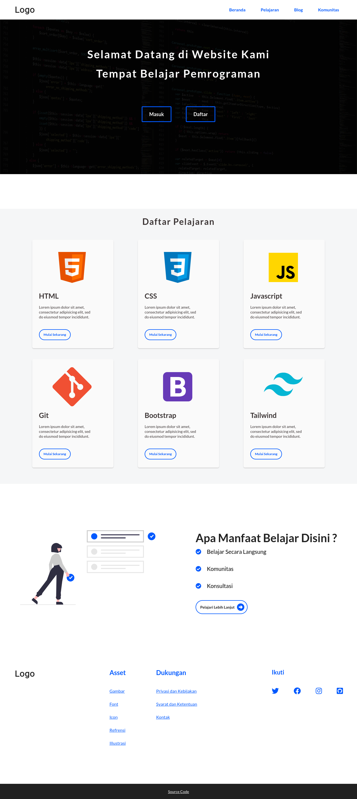

# Website-E-Course

DEMO : https://web-e-course.netlify.app/

#### Full Screenshoot :

Font : **Roboto** and **Lato** , *[fontsgoogle](https://fonts.google.com/)*
Image : *[pixabay](https://pixabay.com/)*
Illustration : *[undraw](https://undraw.co/)*
Icon : *[fontawesome](https://fontawesome.com/)*
References : *[pinterest](https://www.pinterest.com/)*

##### Logo
1. HTML, CSS, Javascript, Bootstrap : *<https://icons8.com/>*
2. GIT : *<https://git-scm.com/downloads/logos>*
3. Tailwind : *<https://tailwindcss.com/brand>*
